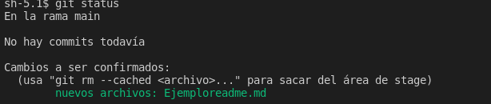
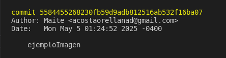

# **Clase 2**
## **Los 3 estados de git**
En Git excisten 3 estados, estos son:
- ### **Modified.** 
  Decimos que un archivo esta en un estado modified, cuando el archivo esta recien creado, eliminado o no tiene cambios registrados.
- ### **Staged.**
  Un archivo se encuentra en estado Staged, cuando el archivo a sido marcado como preparado para ser confirmado en el repositorio local.
- ### **Commited**
  Es cuando el archivo ya se encuentra guardad en el repositorio local.

  ## **Cambios de estado**
    Una vez creado el archivo, estamos en estado **modified** y para sar al estado de **Staged**, se debe seguir los siguientes pasos:

- **git status** (estado de git)
  
  Una vez ya ejecutes los comandos saldria algo como:

Para ejemplo llevaremos a **saged** el archivo Ejemploreadme.md:
- **git add** Ejemploreadme.md
  
  Nuestro archivo esta listo para ser agregado 
- **git commit** se abrira una ventana en VS

Guardas el archivo y lo cierras, tu comit ya estaria hecho.
## **¿Que es un comit?**
Podemos verlo como como un checkpoint en un videojuego, a medida que vamos avanzando tenemos puntos de guardado que resguardan tu progreso en el juego, al tener estos checkpoints puedes volver a cualquiera de estos cuando lo desees ya que estan en un registro de los avances que tuviste.

Un **commit** es similar nos permite registrar los cambios hecho en un repositorio asi tambien cuando y por quien fueron realizados.

## **¿Como hacemos un commit?**
Para hacer un commit los archivos deben haber estado previamente en la etapa de Staged.
Para guardar los cambios hechos puedes usar el sguiente comando:

- **git commit -m "titulo del commit"**

Esto creará un nuevo commit en tu repositorio y añadirá una referencia al commit en la rama que estes trabajando.

El mensaje de commit que se esncuentra entre comillas se usa como titulo del comit donde se describe los cambios realizados.

## **¿Que es el HEAD?**
El HEAD es un marcador que te indica en que commit te encuentras actualmente.

En pocas palabras te dice "estas aquí", y puedes verlo con el siguiente comando:
 
- **git log**

Ejemplo:

