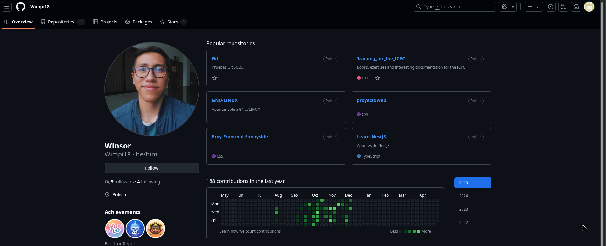
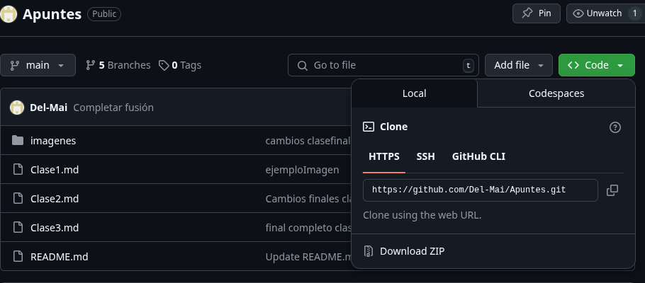

# **CLase 4**
## **¿Git y Github son lo mismo?**
No son lo mismo, **Git** es una herramienta de control de versiones y **GitHub** es una plataforma de alojamiento en la nube donde puedes almacenar, compartir y trabajar junto con otros usuarios para escribir código basado en el sistema de control de versiones que es git.

## **Repositorios remotos**
Los repositorios remotos son repositorios que ese encuentran en un servidor y que nos sirven como punto de sincronización entre diferentes repositorios locales 
 
 

  

 ## **Navegando por GitHub**
  ### **Buscar...**
  

  

  La herramienta de busqueda en GitHub puede ayudarte a encontrar:
  - **Perfiles**
  
     En la herramienta de busqueda, escribimos el user

  

  

    Nos apareceran las opciones 
    

  

 Seleccionamos el que deseamos e ingresamos en su perfil 

 

  

  - **Repositorios**

    En la herramienta de busqueda, buscamos el nombre del repo.

    

  

Ingresamos en el repo 
 

  

Estructura de la pagina code:

  

## **Crear un nuevo repositorio**
Para empezar en nuestra pagina principal tenemos 2 opciones para crea un repositorio nuevo. 
 
 - En nuestra pagina principal en la parte lateral derecha tenemos la siguiente opcion: 
  
  

  

- En la pagina principal nos vamos a **create new** y seleccionamos **New repository**.
  
  

  

Posteriormente llenamos los datos con la informacion de nustro nuevo repositorio, como el nombre, su descripción y si este repositorio sera publico o privado.

  

## **Sinronizar el repositorio**
Para sincronizar nuestro repo usaremos el siguiente comando:

- **git remote add nombre del repositorio remoto url repo**
  
**¿como obtenemos el url?**
En nuestro repositorio en GitHub vamos al apartado que dice **< code >** y podemos copiar la url de nuestro repositorio.

  

Una ves vinculdado podemos realizar el siguiente comando:
  
  - **git remote -v**
  
  Este nos permitira ver las conexiiones remotas que tienes.

 
## **Vincular mediante claves SSH**
**Crear la key**
- ssh-keygen -t rsa -b 4096 <tucorreo@gmail.com>
- Al crearlo podras elegir una passphrase
  
**Pondremos a ejecutar la llave**

- eval "$(ssh-agent -s)"
  
**Añadir la llave**

- ssh-add~/.ssh/id_rsa
- Copias del portapapeles el id_rsa.pub
- Pegas en la seccion key de tu repositorio.
  
**¿Para que vinculamos mediante claves SSH?**

Usamoslas claves SSH para proteger nuestro repositorio y solo personas que tengan la clave SSH puedan trbajar en nuestro repositorio. Se usan tambien para evitar que alguien se haga pasar por ti, ya que la firma se creara con caracteristicas propias de tu usuario, cuenta de GitHub, tu computadora, y asi se hara un identificador unico.

## **Clonar un Repositorio**
Cuando queremos entrar a un repositorio ya existente lo que debemos hacer es clonar dicho repositorio, existen dos formas que son las siguientes 

- ### **Clonar por HTTPS:** 
  
  **git clone  url_repo_HTTPS**

- ### **Clonar por SSH**
  
  **git clone url_repo_SSH**

## **Subir cambios al Repositorio remoto**
Para porder subir los cambios a nuestro repositorio remoto usamos el **push**, usando el siguiente comando:

- **git push origin nombre_de_la_rama**
  
  (origin seria el alias que hace referencia a una url).

  

  |Comandos |Función|
  |--------|:------|
  |git remote add origin < url > | Conecta tu repositorio local con un repositorio remoto y le pone el nombre origin. |
  |git remote -v| Lista de los repositorios remotos|
  |git remote prune origin| Limpiar (eliminar) las referencias locales a ramas remotas que ya no existen en el repositorio remoto.|
  |git push origin < rama >|Sube la rama  al repositorio remoto origin. Si es la primera vez que subes esa rama, también la creará en el remoto.|
  |git fetch|Actualiza tu copia local de las referencias remotas.|
  |git branch| Te da una visión completa de todas las ramas disponibles|
  |git switch < rama_remota >|cambia tu rama actual a la que indiques con < rama_remota >|

  

  ## **Diferencias entre git push y git pull**

  - **Git push.** Nos sirve para empujar cualquier cambio realizado del repositorio local al repositorio remoto.