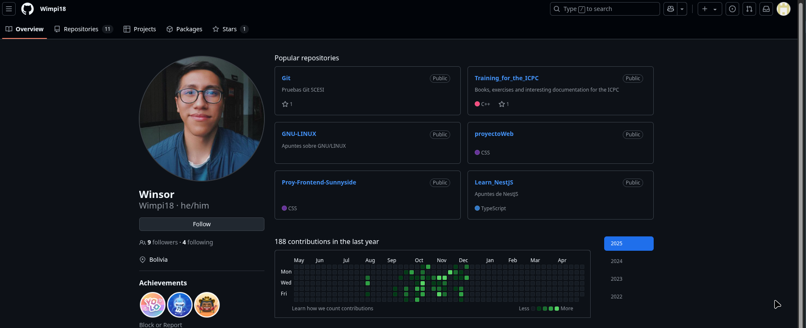

# **Cursos de Git/Github**
## **¿Que es un control de versiones?**
Es un sistema que registra cada cambio que realices en el codigo funte de un proyecto. 
Esto nos permite tener un historial de cada uno de los cambios que se realizo y por quien se realizó el cambio. Una forma fácil de verlo es como marcar un checkpoint en un videojuego.

  

## **Importancia de un control de versiones**
Al usar un control de versiones tenemos beneficios como ser:
- **Colaboracion eficiente.** Permite que múltiples personas puedan trabajr en el mismo proyecto sin afectar al trabajo de otros, esto es gracias a las ramas.
- **Historial de cambios.** Nos permite ver que tipos de cambio se realizaron, cuándo y por quién se realizaron.
- **Seguridad y respaldo.** Brida una copia de seguridad de los archivos, lo que nos asegura la conservacion e integrida de los mismos.
- **Flexibilidad.** No es necesario un desarrollo lineal.

## **¿Que es git?**
Git es un sistema de control de versiones distribuida, que nos proporciona una copia del respositorio en nustra maquina local para despues pueda ser subido a un repositorio remoto, esto nos permite hacer trabajo colaborativo sin afectar al resto de participantes.

 

## **¿Que es un repositorio?**  
 Es una carpeta donde se guardan las diferentes versiones de los ficheros de un proyecto, realiza un historial de cada cambio realizado. 
 Una forma facil de ver un repositorio es como una estanteria de libros o una estanteria en donde guardamos cajas con documentos con fecha y hora.

 ## **Iniciar un proyecto en git**
 Para iniciar un proyecto en git tenemos dos opciones, desde cero o uno ya excistente.
 - **Desde cero.** 
    1. **git init** < nombre de tu proyecto >
    2. **cd**< nombre del proyecto > 
- **Ya existente:**
  
    1. **cd** < directorio ya existente >
    2. **git init**
   
# **Clase 2**
## **Los 3 estados de git**
En Git excisten 3 estados, estos son:
- ### **Modified.** 
  Decimos que un archivo esta en un estado modified, cuando el archivo esta recien creado, eliminado o no tiene cambios registrados.
- ### **Staged.**
  Un archivo se encuentra en estado Staged, cuando el archivo a sido marcado como preparado para ser confirmado en el repositorio local.
- ### **Commited**
  Es cuando el archivo ya se encuentra guardad en el repositorio local.

  ## **Cambios de estado**
    Una vez creado el archivo, estamos en estado **modified** y para sar al estado de **Staged**, se debe seguir los siguientes pasos:

- **git status** (estado de git)
  
  Una vez ya ejecutes los comandos saldria algo como:

Para ejemplo llevaremos a **saged** el archivo Ejemploreadme.md:
- **git add** Ejemploreadme.md
  
  Nuestro archivo esta listo para ser agregado 
- **git commit** se abrira una ventana en VS

Guardas el archivo y lo cierras, tu comit ya estaria hecho.
## **¿Que es un comit?**
Podemos verlo como como un checkpoint en un videojuego, a medida que vamos avanzando tenemos puntos de guardado que resguardan tu progreso en el juego, al tener estos checkpoints puedes volver a cualquiera de estos cuando lo desees ya que estan en un registro de los avances que tuviste.

Un **commit** es similar nos permite registrar los cambios hecho en un repositorio asi tambien cuando y por quien fueron realizados.

## **¿Como hacemos un commit?**
Para hacer un commit los archivos deben haber estado previamente en la etapa de Staged.
Para guardar los cambios hechos puedes usar el sguiente comando:

- **git commit -m "titulo del commit"**

Esto creará un nuevo commit en tu repositorio y añadirá una referencia al commit en la rama que estes trabajando.

El mensaje de commit que se esncuentra entre comillas se usa como titulo del comit donde se describe los cambios realizados.

## **¿Que es el HEAD?**
El HEAD es un marcador que te indica en que commit te encuentras actualmente.

En pocas palabras te dice "estas aquí", y puedes verlo con el siguiente comando:
 
- **git log**

Ejemplo:

## **¿Que es una rama?**

Una rama es una linea de desarrollo independiente o una version de el repositorio. al ser una bifurcacion de nuestra rama principal nos permite relizar cambios manteniendolos en esa rama y separandolas de los demas, esto hace posible el desarrollo en paralelo sin afectar a las demas ramas o a la rama principal.

Debemos tomar en cuenta que cuando vallamos a realizar cambios por mas pequeños que sean se debe crea una rama para asi encapsular dichos cambios, estos cambios tambien se podran unir a la rama principal una vez el trabajo este realizado.

## **¿Como creamos una rama?**
 Para la creacion de una rama debemos realizar el siguiente comando:
 
 - **git branch rama_nombre de la rama**
  
Esto nos generara una rama mas no nos cambia de rama. 
## **¿Entonces como cambiamos de rama?**
 Para cambiar de rama tenemos 2 opciones de comando:

 - **git checkout rama_nombre de la rama**
 - **git switch rama_nombre de la rama**
  
  De estas dos opciones la se recomienda el uso de git switch, ya que git checkout tiene mas funciones además de cambiar de rama. Tambien es recomendable que despues del cambio de rama se realice un git log para que te muestre el HEAD y así asegurarse de que estás en la rama que deses.
# **Clase 3**
## **Fusionamos una rama**
Usualmete fusionamos una rama para que los cambios que realizamos en una rama se incorporen o asimilen a otra rama, esto no siempre pasa por que hay ramas que tienden a quear en el olvido.

Para fusionar una rama debemos usar el comando:

- **git merge**
  
Al realizar este comando se realiza automaticamente un commit que nos incluye todos los cambios de la rama de origen a la rama en la que nos encontramos en ese momento. Si queremos editar o evitar que git haga el commit automaticamente usamos los siguientes comandos:

- **git merge --edit** (Abre el editor antes de hacer el commit)
- **git merge --no-commit** ( No hace el commit automaticamente)

## **Eliminar una rama**
Eliminar una rama es conciderado una buena practica, ya que hay muchas ramas que pueden perder funcionalidad a medida que nuestor proyecto vaya evolucionando.

Para eliminar una rama ejecutamos los siguiente comandos:

- git branch --delete nombre_de_la_rama
- git branch -d nombre_de_la_rama
  
## **Conflictos en git**
Se dan cuando git no es capaz de determinar que cambio es el que debe prevalecer una vez ocurra la fusión.

**¿Como los resolvemos?**

Cuando nos ocurra esto debemos seleccionar con que cambio nos quedaremos, si con los cambios de la rama main o nos quedamos con la rama chages.

# **CLase 4**
## **¿Git y Github son lo mismo?**
No son lo mismo, **Git** es una herramienta de control de versiones y **GitHub** es una plataforma de alojamiento en la nube donde puedes almacenar, compartir y trabajar junto con otros usuarios para escribir código basado en el sistema de control de versiones que es git.

## **Repositorios remotos**
Los repositorios remotos son repositorios que ese encuentran en un servidor y que nos sirven como punto de sincronización entre diferentes repositorios locales 
 
 

  

 ## **Navegando por GitHub**
  ### **Buscar...**
  

  

  La herramienta de busqueda en GitHub puede ayudarte a encontrar:
  - **Perfiles**
  
     En la herramienta de busqueda, escribimos el user

  

  

    Nos apareceran las opciones 
    

  

 Seleccionamos el que deseamos e ingresamos en su perfil 

 

  

  - **Repositorios**

    En la herramienta de busqueda, buscamos el nombre del repo.

    

  

Ingresamos en el repo 
 

  

Estructura de la pagina code:

  

## **Crear un nuevo repositorio**
Para empezar en nuestra pagina principal tenemos 2 opciones para crea un repositorio nuevo. 
 
 - En nuestra pagina principal en la parte lateral derecha tenemos la siguiente opcion: 
  
  

  

- En la pagina principal nos vamos a **create new** y seleccionamos **New repository**.
  
  

  

Posteriormente llenamos los datos con la informacion de nustro nuevo repositorio, como el nombre, su descripción y si este repositorio sera publico o privado.

  

## **Sinronizar el repositorio**
Para sincronizar nuestro repo usaremos el siguiente comando:

- **git remote add nombre del repositorio remoto url repo**
  
**¿como obtenemos el url?**
En nuestro repositorio en GitHub vamos al apartado que dice **< code >** y podemos copiar la url de nuestro repositorio.

  

Una ves vinculdado podemos realizar el siguiente comando:
  
  - **git remote -v**
  
  Este nos permitira ver las conexiiones remotas que tienes.

 
## **Vincular mediante claves SSH**
**Crear la key**
- ssh-keygen -t rsa -b 4096 <tucorreo@gmail.com>
- Al crearlo podras elegir una passphrase
  
**Pondremos a ejecutar la llave**

- eval "$(ssh-agent -s)"
  
**Añadir la llave**

- ssh-add~/.ssh/id_rsa
- Copias del portapapeles el id_rsa.pub
- Pegas en la seccion key de tu repositorio.
  
**¿Para que vinculamos mediante claves SSH?**

Usamoslas claves SSH para proteger nuestro repositorio y solo personas que tengan la clave SSH puedan trbajar en nuestro repositorio. Se usan tambien para evitar que alguien se haga pasar por ti, ya que la firma se creara con caracteristicas propias de tu usuario, cuenta de GitHub, tu computadora, y asi se hara un identificador unico.

## **Clonar un Repositorio**
Cuando queremos entrar a un repositorio ya existente lo que debemos hacer es clonar dicho repositorio, existen dos formas que son las siguientes 

- ### **Clonar por HTTPS:** 
  
  **git clone  url_repo_HTTPS**

- ### **Clonar por SSH**
  
  **git clone url_repo_SSH**

## **Subir cambios al Repositorio remoto**
Para porder subir los cambios a nuestro repositorio remoto usamos el **push**, usando el siguiente comando:

- **git push origin nombre_de_la_rama**
  
  (origin seria el alias que hace referencia a una url).

  

  |Comandos |Función|
  |--------|:------|
  |git remote add origin < url > | Conecta tu repositorio local con un repositorio remoto y le pone el nombre origin. |
  |git remote -v| Lista de los repositorios remotos|
  |git remote prune origin| Limpiar (eliminar) las referencias locales a ramas remotas que ya no existen en el repositorio remoto.|
  |git push origin < rama >|Sube la rama  al repositorio remoto origin. Si es la primera vez que subes esa rama, también la creará en el remoto.|
  |git fetch|Actualiza tu copia local de las referencias remotas.|
  |git branch| Te da una visión completa de todas las ramas disponibles|
  |git switch < rama_remota >|cambia tu rama actual a la que indiques con < rama_remota >|

  

  ## **Diferencias entre git push y git pull**

  - **Git push.** Nos sirve para empujar cualquier cambio realizado del repositorio local al repositorio remoto.